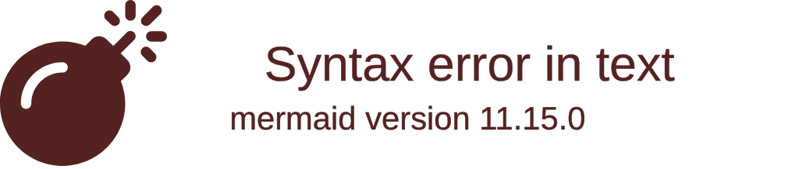
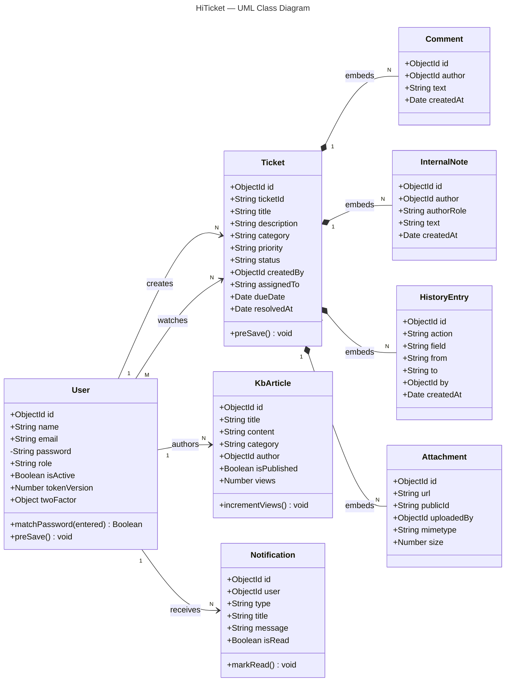
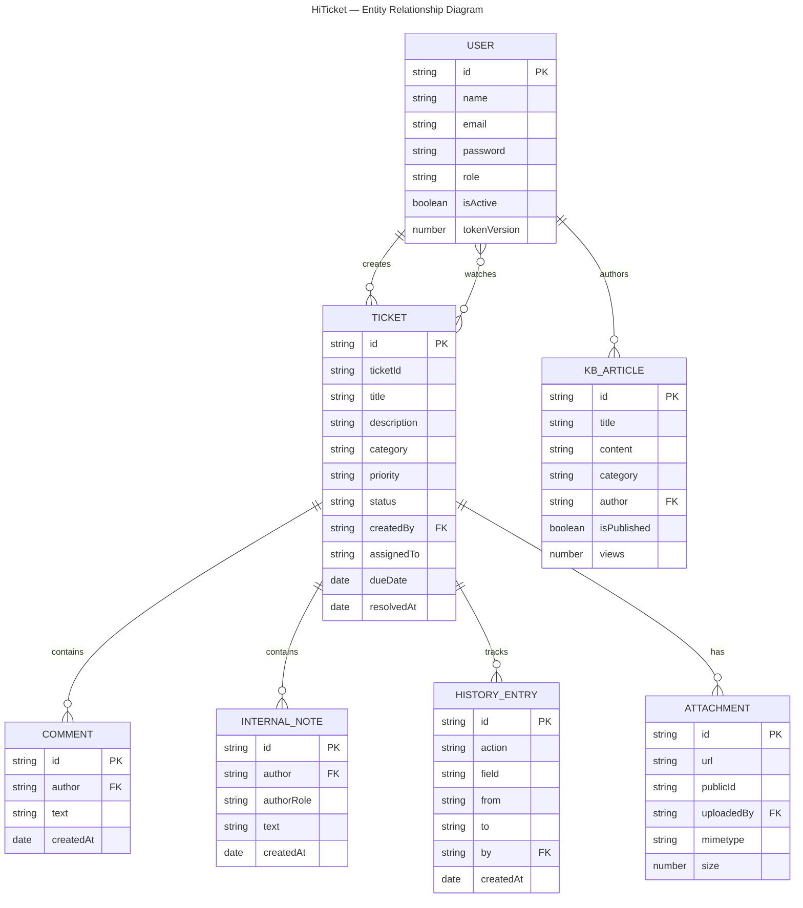
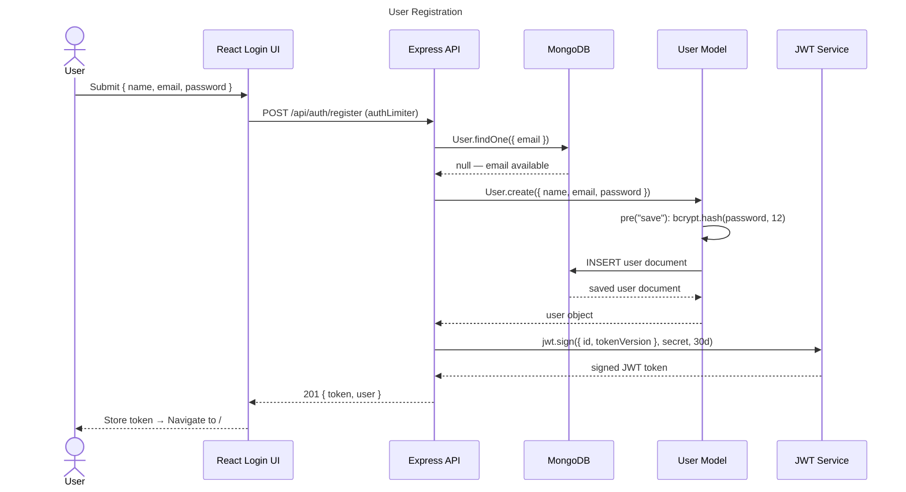
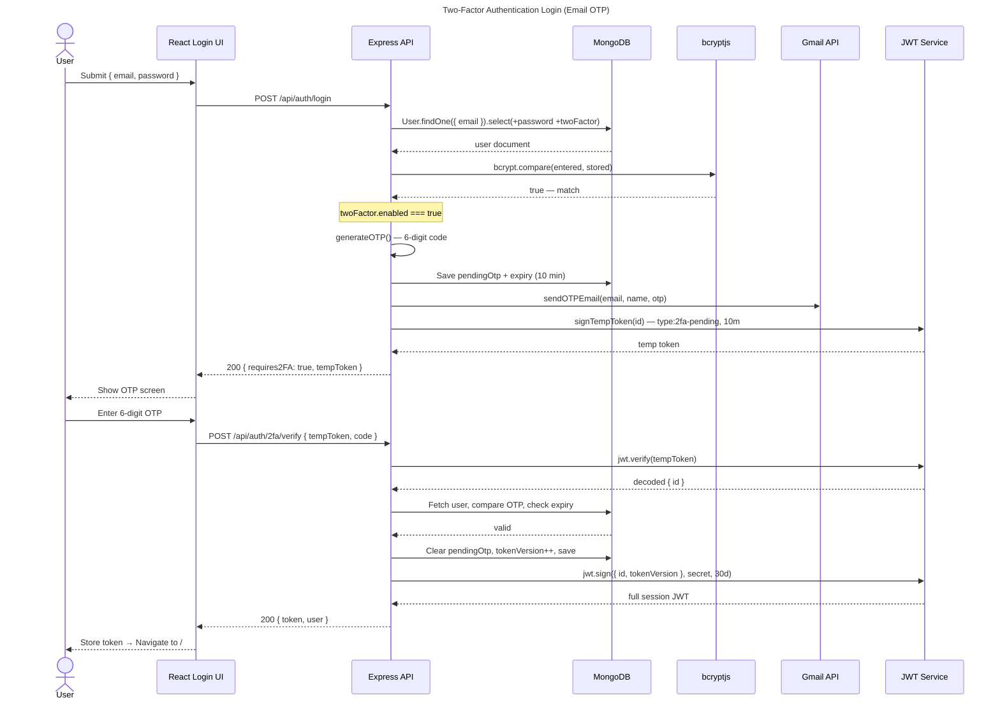
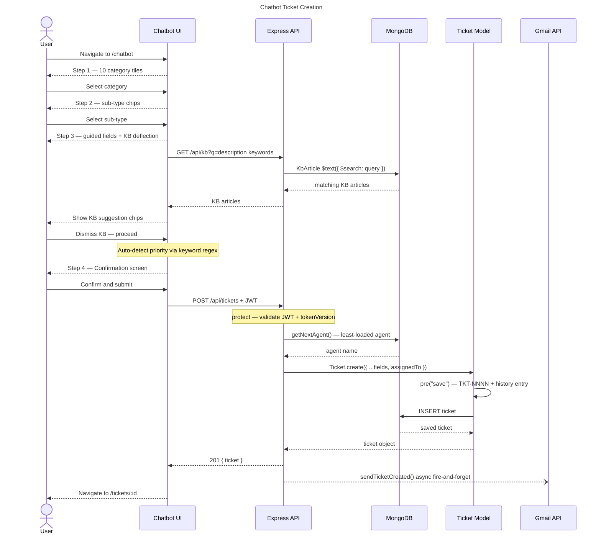
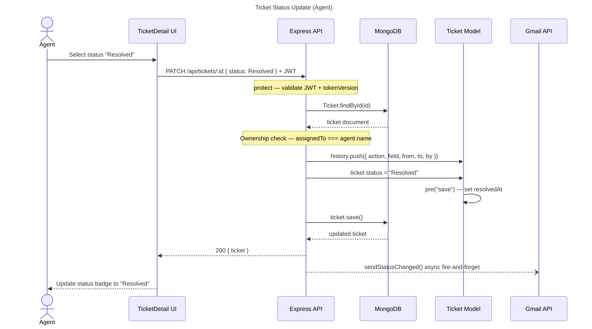

# HiTicket — Mermaid Diagrams

All UML and architectural diagrams for the HiTicket project in Mermaid `.mmd` format.  
Open any `.mmd` file in VS Code with the [Mermaid Preview](https://marketplace.visualstudio.com/items?itemName=bierner.markdown-mermaid) or [Mermaid Editor](https://marketplace.visualstudio.com/items?itemName=tomoyukim.vscode-mermaid-editor) extension to render them.

---

## Diagram Index

| File | Type | Description |
|------|------|-------------|
| [01_architecture.mmd](01_architecture.mmd) | `architecture-beta` | Three-tier system architecture (Presentation → Application → Data) |
| [02_class_diagram.mmd](02_class_diagram.mmd) | `classDiagram` | UML Class Diagram — User, Ticket, KbArticle, Notification + embedded sub-docs |
| [03_er_diagram.mmd](03_er_diagram.mmd) | `erDiagram` | Entity Relationship Diagram — all collections and their relationships |
| [04_sequence_registration.mmd](04_sequence_registration.mmd) | `sequenceDiagram` | User Registration flow (13 steps) |
| [05_sequence_2fa_login.mmd](05_sequence_2fa_login.mmd) | `sequenceDiagram` | Two-Factor Authentication Login via Email OTP (21 steps) |
| [06_sequence_chatbot_ticket.mmd](06_sequence_chatbot_ticket.mmd) | `sequenceDiagram` | Chatbot Ticket Creation wizard with KB deflection (25 steps) |
| [07_sequence_status_update.mmd](07_sequence_status_update.mmd) | `sequenceDiagram` | Ticket Status Update by Agent (14 steps) |

---

## Architecture Overview

---

## Class Diagram

---

## ER Diagram

---

## Sequence — Registration

---

## Sequence — 2FA Login

---

## Sequence — Chatbot Ticket Creation

---

## Sequence — Status Update

